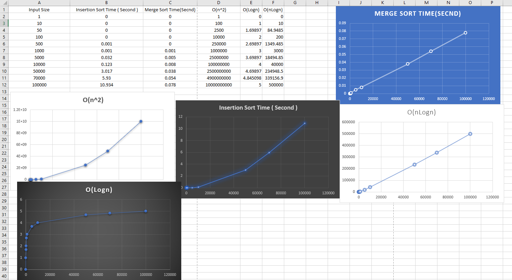

# **Merge Sort Time Complexity Analysis** 🚀  

This repository contains an analysis of **Merge Sort** and **Insertion Sort** time complexities, comparing their performances with different input sizes. The results are visualized using Excel charts. 📊  

---

## 📂 **Project Structure**  
```
📦 mergesort_TimeComplexity  
 ├── 📄 merge.cpp          # C++ implementation of Merge Sort  
 ├── 📄 input.txt          # Input dataset for testing  
 ├── 📊 mergesort.xlsx     # Excel file with time complexity analysis  
 ├── 🖼️ image.png         # Visualization of results  
 ├── 📜 README.md         # Documentation  
```

---

## 🚀 **Implementation**  
### 🔹 **Merge Sort (C++)**  
Merge Sort is an efficient **O(n log n)** sorting algorithm that follows the **divide and conquer** approach.  

```cpp
void mergeSort(vector<int>& arr, int left, int right) {
    if (left < right) {
        int mid = left + (right - left) / 2;
        mergeSort(arr, left, mid);
        mergeSort(arr, mid + 1, right);
        merge(arr, left, mid, right);
    }
}
```

---

## 📈 **Performance Comparison**  
| Input Size | Insertion Sort (s) | Merge Sort (s) |
|------------|-------------------|---------------|
| 1          | 0                 | 0             |
| 10         | 0                 | 0             |
| 100        | 0                 | 0             |
| 1000       | 0.001             | 0.001         |
| 10000      | 0.123             | 0.008         |
| 50000      | 3.017             | 0.038         |
| 100000     | 10.934            | 0.078         |

📌 **Observations:**  
✅ Merge Sort is significantly faster for large inputs.  
✅ Insertion Sort performs well for small inputs but becomes inefficient for larger datasets.  

---

## 🎨 **Visualizations**  
📊 The following charts demonstrate the **time complexities** of Merge Sort and Insertion Sort:  

  

---

## 🤖 **How to Run?**  
1. Clone the repository:  
   ```bash
   git clone https://github.com/your-username/mergesort_TimeComplexity.git
   ```
2. Navigate to the directory:  
   ```bash
   cd mergesort_TimeComplexity
   ```
3. Compile the C++ program:  
   ```bash
   g++ merge.cpp -o merge
   ```
4. Run the program:  
   ```bash
   ./merge
   ```

---

👨‍💻 **Developed by [Mehe Raaj](https://github.com/meheraaj)**  

---

